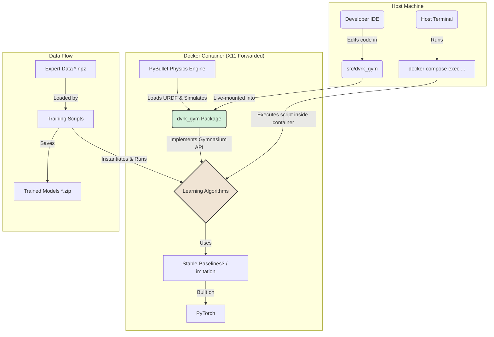
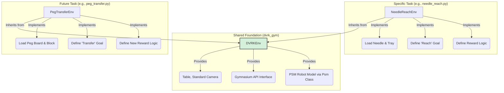

# System Patterns

## 1. Core Architecture
The system is designed around a clean separation of concerns, with the custom robot environment decoupled from the learning algorithms.



## 2. Key Design Patterns

-   **Installable Package (`dvrk_gym`)**: The environment is developed as a proper Python package within a `src` layout. It is installed inside the Docker container using `pip install -e .`, making it available throughout the environment.
-   **Live Code Mounting**: The host's `src` directory is volume-mounted into the container. This allows for live code editing on the host IDE, with changes immediately reflected inside the container without rebuilding the image.
-   **Standardized API (Gymnasium)**: By strictly adhering to the `gymnasium.Env` interface, we ensure compatibility with modern RL and IL libraries.
-   **Containerized & Reproducible Environment**: The `Dockerfile` and `docker-compose.yml` define a reproducible environment, ensuring consistent behavior across machines.
-   **GUI for Debugging (X11 Forwarding)**: The container is configured for X11 forwarding, allowing GUI windows from applications like PyBullet to be displayed directly on the host's desktop for interactive debugging and visualization.

## 3. PyBullet Environment Configuration Patterns
Replicating a PyBullet environment from a reference implementation requires meticulous attention to detail. The following patterns were established during the debugging and configuration of the `NeedleReach-v0` environment.

-   **Gymnasium `__init__` Compliance**: The `__init__` method of a custom environment **must** define valid `observation_space` and `action_space` attributes before it returns. It cannot be deferred to the `reset` method.
    -   **Solution**: To resolve dependencies (e.g., needing a robot model to exist to define spaces), a helper method (`_pre_setup`) is called from `__init__`. This method builds a temporary but complete version of the scene, allowing spaces to be defined correctly. The `reset` method then calls this same helper to rebuild the scene for each new episode.

-   **Scene Reconstruction on Reset**: To ensure a clean state for each episode and match the behavior of legacy systems like SurRoL, the `reset` method should perform a full scene reconstruction by calling `p.resetSimulation()` and then reloading all assets (table, robots, objects).

-   **Camera Persistence**: Camera positioning must be explicitly re-applied after each scene reset.
    -   **Solution**: A dedicated `_setup_camera` method is called at the end of `reset` and at the beginning of `render`. This method computes the view/projection matrices and, for `human` mode, calls `p.resetDebugVisualizerCamera` to enforce the correct viewpoint.

-   **Beware of "Double Scaling"**: When using `globalScaling` in `p.loadURDF`, be aware of how the `basePosition` is handled.
    -   **Problem**: The original SurRoL `Arm` class scaled the `basePosition` coordinates *before* passing them to `p.loadURDF`, which also used `globalScaling`. This "double scaling" was a critical behavior that had to be replicated.
    -   **Solution**: Our `Arm` class was modified to mimic this behavior, ensuring the robot's base is loaded at the correct, scaled position.

-   **Visual and Physical Fidelity**: Achieving a 1:1 match requires checking subtle details beyond core logic.
    -   **Visuals**: Calls to `p.changeVisualShape` to modify parameters like `specularColor` are crucial for matching the look and feel.
    -   **Physics**: URDF properties like `useFixedBase` for objects must be identical to ensure the same physical interactions.

## 4. Environment Architecture: Base Class + Task Subclass
To support multiple surgical tasks efficiently, the project uses an object-oriented inheritance pattern. This separates the shared, complex boilerplate from the simple, task-specific logic.



### Responsibilities

-   **`DVRKEnv` (Base Class)**: Handles the complex, shared logic that is common to all dVRK tasks. This includes:
    -   Setting up the PyBullet simulation.
    -   Loading the surgical table.
    -   Providing a standard camera view.
    -   Managing the core `__init__` and `reset` loop, ensuring compliance with Gymnasium standards.

-   **`*Task*Env` (Subclass)**: Each new surgical gesture is implemented as a new subclass of `DVRKEnv`. Its only responsibilities are to define the unique elements of the task:
    -   **`_env_setup()`**: Load the specific objects for the task (e.g., needle, gauze, peg board).
    -   **`_get_reward()`**: Implement the logic for calculating rewards.
    -   **`_is_success()`**: Implement the logic for determining if the task is complete.
    -   **`_get_obs()`**: Define the precise contents of the observation dictionary for the task.

This architecture makes adding new tasks straightforward, as developers can focus solely on the task-specific logic without worrying about the underlying environment setup.

## 5. Data Handling Pattern: Flattening for Robustness

A critical pattern emerged during the debugging of the `imitation` library's issues with `Dict` observation spaces.

-   **Problem**: Third-party libraries, even popular ones, may have incomplete or buggy support for complex data structures like `gymnasium.spaces.Dict`. This can lead to cryptic errors that are difficult to debug. In our case, the `imitation` library's internal validation logic consistently failed to correctly interpret the length of our `Dict` observation data.

-   **Solution**: The most robust and pragmatic solution is to **preprocess the data into the simplest possible format before passing it to the library**. For `Dict` spaces, this means flattening the dictionary observation into a single, flat `Box` (NumPy array) space.

    ```python
    # Example from train_bc.py
    # Flatten each observation dictionary into a single numpy array
    for i in range(num_transitions):
        flat_obs = np.concatenate([
            obs_soa['observation'][i],
            obs_soa['achieved_goal'][i],
            obs_soa['desired_goal'][i]
        ])
        all_obs.append(flat_obs)
    ```

-   **Pattern**: When encountering persistent, unexplainable errors within a library's data handling pipeline, always consider "dumbing down" your data format. By converting complex structures to simple, flat arrays, you can circumvent potential bugs in the library's internal processing and regain control over the data pipeline. This is a powerful fallback strategy for ensuring compatibility and robustness.
