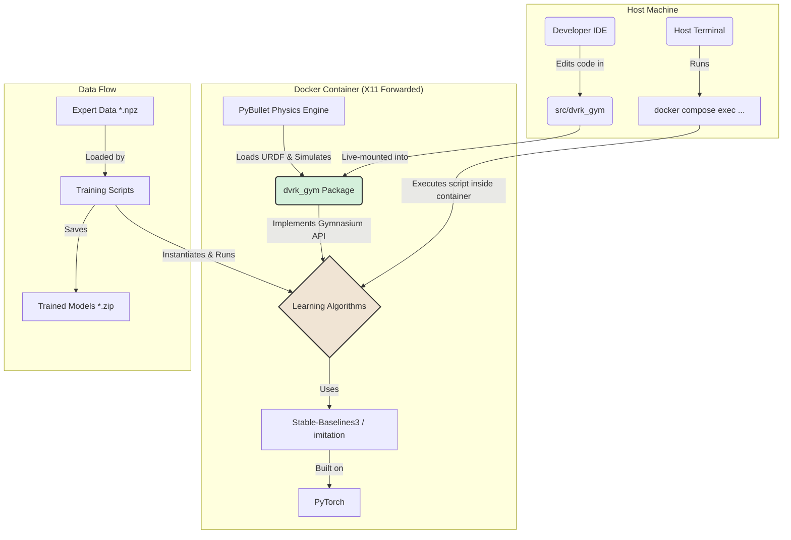

# System Patterns

## 1. Core Architecture
The system is designed around a clean separation of concerns, with the custom robot environment decoupled from the learning algorithms.

## 2. Key Design Patterns

-   **Installable Package (`dvrk_gym`)**: The environment is developed as a proper Python package within a `src` layout. It is installed inside the Docker container using `pip install -e .`, making it available throughout the environment.
-   **Live Code Mounting**: The host's `src` directory is volume-mounted into the container. This allows for live code editing on the host IDE, with changes immediately reflected inside the container without rebuilding the image.
-   **Standardized API (Gymnasium)**: By strictly adhering to the `gymnasium.Env` interface, we ensure compatibility with modern RL and IL libraries.
-   **Containerized & Reproducible Environment**: The `Dockerfile` and `docker-compose.yml` define a reproducible environment, ensuring consistent behavior across machines.
-   **GUI for Debugging (X11 Forwarding)**: The container is configured for X11 forwarding, allowing GUI windows from applications like PyBullet to be displayed directly on the host's desktop for interactive debugging and visualization.
