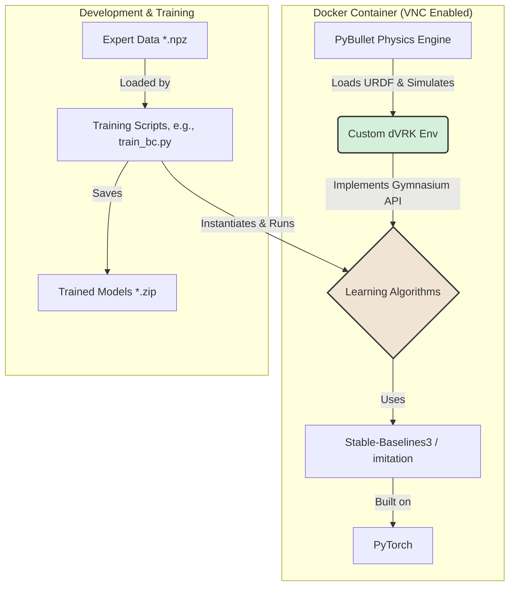

# System Patterns

## 1. Core Architecture
The system is designed around a clean separation of concerns, with the custom robot environment decoupled from the learning algorithms.

## 2. Key Design Patterns

-   **Environment as a Library (`dvrk_gym`)**: The dVRK environment is developed as a self-contained Python package. This allows it to be easily imported, versioned, and used by any learning framework that supports the Gymnasium API.
-   **Standardized API (Gymnasium)**: By strictly adhering to the `gymnasium.Env` interface (including `step`, `reset`, `observation_space`, `action_space`), we ensure that our environment is immediately compatible with the vast majority of modern RL and IL libraries.
-   **Containerized & Reproducible Environment**: All development and training occurs within a Docker container. The `Dockerfile` precisely defines all system dependencies, Python packages, and environment setup, guaranteeing that the simulation is reproducible across different machines.
-   **GUI for Debugging**: The container includes a VNC-accessible desktop environment. This allows developers to run the simulation in `GUI` mode for interactive debugging, visualization, and data collection, while still enabling `headless` training for large-scale experiments.
