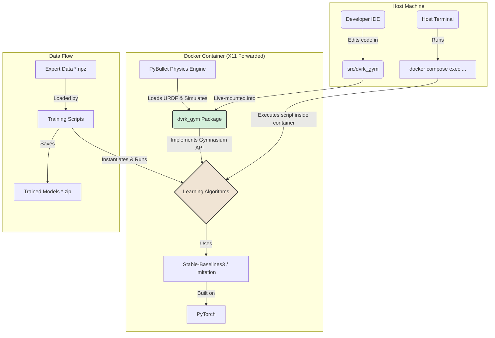
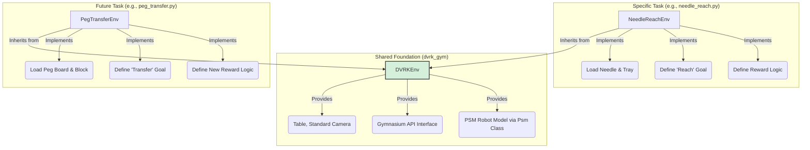

# System Patterns

## 1. Core Architecture
The system is designed around a clean separation of concerns, with the custom robot environment decoupled from the learning algorithms.



## 2. Key Design Patterns

-   **Installable Package (`dvrk_gym`)**: The environment is developed as a proper Python package within a `src` layout. It is installed inside the Docker container using `pip install -e .`, making it available throughout the environment.
-   **Live Code Mounting**: The host's `src` directory is volume-mounted into the container. This allows for live code editing on the host IDE, with changes immediately reflected inside the container without rebuilding the image.
-   **Standardized API (Gymnasium)**: By strictly adhering to the `gymnasium.Env` interface, we ensure compatibility with modern RL and IL libraries.
-   **Containerized & Reproducible Environment**: The `Dockerfile` and `docker-compose.yml` define a reproducible environment, ensuring consistent behavior across machines.
-   **GUI for Debugging (X11 Forwarding)**: The container is configured for X11 forwarding, allowing GUI windows from applications like PyBullet to be displayed directly on the host's desktop for interactive debugging and visualization.

## 3. PyBullet Environment Configuration Patterns
Replicating a PyBullet environment from a reference implementation requires meticulous attention to detail. The following patterns were established during the debugging and configuration of the `NeedleReach-v0` environment.

-   **Gymnasium `__init__` Compliance**: The `__init__` method of a custom environment **must** define valid `observation_space` and `action_space` attributes before it returns. It cannot be deferred to the `reset` method.
    -   **Solution**: To resolve dependencies (e.g., needing a robot model to exist to define spaces), a helper method (`_pre_setup`) is called from `__init__`. This method builds a temporary but complete version of the scene, allowing spaces to be defined correctly. The `reset` method then calls this same helper to rebuild the scene for each new episode.

-   **Scene Reconstruction on Reset**: To ensure a clean state for each episode and match the behavior of legacy systems like SurRoL, the `reset` method should perform a full scene reconstruction by calling `p.resetSimulation()` and then reloading all assets (table, robots, objects).

-   **Camera Persistence**: Camera positioning must be explicitly re-applied after each scene reset.
    -   **Solution**: A dedicated `_setup_camera` method is called at the end of `reset` and at the beginning of `render`. This method computes the view/projection matrices and, for `human` mode, calls `p.resetDebugVisualizerCamera` to enforce the correct viewpoint.

-   **Beware of "Double Scaling"**: When using `globalScaling` in `p.loadURDF`, be aware of how the `basePosition` is handled.
    -   **Problem**: The original SurRoL `Arm` class scaled the `basePosition` coordinates *before* passing them to `p.loadURDF`, which also used `globalScaling`. This "double scaling" was a critical behavior that had to be replicated.
    -   **Solution**: Our `Arm` class was modified to mimic this behavior, ensuring the robot's base is loaded at the correct, scaled position.

-   **Visual and Physical Fidelity**: Achieving a 1:1 match requires checking subtle details beyond core logic.
    -   **Visuals**: Calls to `p.changeVisualShape` to modify parameters like `specularColor` are crucial for matching the look and feel.
    -   **Physics**: URDF properties like `useFixedBase` for objects must be identical to ensure the same physical interactions.

## 4. Environment Architecture: Base Class + Task Subclass
To support multiple surgical tasks efficiently, the project uses an object-oriented inheritance pattern. This separates the shared, complex boilerplate from the simple, task-specific logic.



### Responsibilities

-   **`DVRKEnv` (Base Class)**: Handles the complex, shared logic that is common to all dVRK tasks. This includes:
    -   Setting up the PyBullet simulation.
    -   Loading the surgical table.
    -   Providing a standard camera view.
    -   Managing the core `__init__` and `reset` loop, ensuring compliance with Gymnasium standards.

-   **`*Task*Env` (Subclass)**: Each new surgical gesture is implemented as a new subclass of `DVRKEnv`. Its only responsibilities are to define the unique elements of the task:
    -   **`_env_setup()`**: Load the specific objects for the task (e.g., needle, gauze, peg board).
    -   **`_get_reward()`**: Implement the logic for calculating rewards.
    -   **`_is_success()`**: Implement the logic for determining if the task is complete.
    -   **`_get_obs()`**: Define the precise contents of the observation dictionary for the task.

This architecture makes adding new tasks straightforward, as developers can focus solely on the task-specific logic without worrying about the underlying environment setup.

## 5. Reward Shaping for Algorithm Compatibility

A critical pattern for ensuring successful training across different learning paradigms (pure RL vs. imitation-based) is the flexible implementation of reward functions.

-   **Problem**: Different learning algorithms have vastly different requirements for reward signals.
    -   **Pure RL (e.g., PPO)**: These algorithms learn from scratch via trial and error. They require a **dense reward** signal that provides a continuous gradient of feedback (e.g., "you're getting warmer/colder") to guide exploration effectively. Without it, they get stuck, as they cannot distinguish between a "bad" action and a "less bad" action.
    -   **Imitation-Augmented RL (e.g., DAPG)**: These algorithms start with a strong prior from expert demonstrations. They benefit from a **sparse reward** signal (e.g., a simple `0` for success and `-1` for failure). This provides a clear, unambiguous final objective without "hacking" the agent's behavior by making it chase a potentially flawed dense reward metric instead of following the expert's style.

-   **Solution**: The environment should support both reward types, selectable at initialization. This is achieved by adding a constructor argument to the task-specific environment class.

    ```python
    # In the __init__ of a task environment like NeedleReachEnv
    def __init__(self, render_mode: str = None, use_dense_reward: bool = False):
        self.use_dense_reward = use_dense_reward
        super().__init__(...)

    # The main _get_reward method acts as a router
    def _get_reward(self, obs: dict) -> float:
        if self.use_dense_reward:
            return self._get_dense_reward(obs)
        else:
            return self._get_sparse_reward(obs)

    # Specific implementations for each reward type
    def _get_sparse_reward(self, obs: dict) -> float:
        return 0.0 if self._is_success(obs) else -1.0

    def _get_dense_reward(self, obs: dict) -> float:
        return -np.linalg.norm(obs['achieved_goal'] - obs['desired_goal'])
    ```

-   **Pattern**: By implementing this switch, the training script for pure RL can enable dense rewards (`gym.make("MyEnv-v0", use_dense_reward=True)`), while scripts for DAPG can use the default sparse reward. This maintains a single, clean environment implementation that is compatible with the entire standardized policy development workflow.

## 6. Data Handling Pattern: Flattening for Robustness

A critical pattern emerged during the debugging of the `imitation` library's issues with `Dict` observation spaces.

-   **Problem**: Third-party libraries, even popular ones, may have incomplete or buggy support for complex data structures like `gymnasium.spaces.Dict`. This can lead to cryptic errors that are difficult to debug. In our case, the `imitation` library's internal validation logic consistently failed to correctly interpret the length of our `Dict` observation data.

-   **Solution**: The most robust and pragmatic solution is to **preprocess the data into the simplest possible format before passing it to the library**. For `Dict` spaces, this means flattening the dictionary observation into a single, flat `Box` (NumPy array) space.

    ```python
    # Example from train_bc.py
    # Flatten each observation dictionary into a single numpy array
    for i in range(num_transitions):
        flat_obs = np.concatenate([
            obs_soa['observation'][i],
            obs_soa['achieved_goal'][i],
            obs_soa['desired_goal'][i]
        ])
        all_obs.append(flat_obs)
    ```

-   **Pattern**: When encountering persistent, unexplainable errors within a library's data handling pipeline, always consider "dumbing down" your data format. By converting complex structures to simple, flat arrays, you can circumvent potential bugs in the library's internal processing and regain control over the data pipeline. This is a powerful fallback strategy for ensuring compatibility and robustness.

## 7. Standardized Policy Development Workflow
To ensure a systematic, repeatable, and extensible approach to developing policies for new robotic tasks, the project has adopted a standardized three-stage workflow. This workflow leverages the strengths of different learning paradigms to progressively build more capable and robust agents.

```mermaid
graph TD
    A[1. Collect Expert Data] --> B{2. Train BC Policy};
    B --> C{3. Fine-tune with DAPG};
    C --> D{4. (Optional) Train RRL};
    D --> E[5. Deploy & Evaluate];

    subgraph "Imitation Learning (Offline)"
        B
    end

    subgraph "Reinforcement Learning (Online)"
        C
        D
    end

    style B fill:#d4f0db,stroke:#333,stroke-width:2px
    style C fill:#f0e4d4,stroke:#333,stroke-width:2px
    style D fill:#f0e4d4,stroke:#333,stroke-width:2px
```

### Stage 1: Behavioral Cloning (BC)
-   **Goal**: Quickly establish a baseline policy that can successfully perform the task under ideal conditions.
-   **Process**: Train a policy using supervised learning on a collected set of expert demonstrations.
-   **Outcome**: A functional but potentially brittle policy that is highly dependent on the quality and coverage of the expert data. It is susceptible to "covariate shift."

### Stage 2: Demonstration-Augmented Policy Gradient (DAPG)
-   **Goal**: Improve the robustness and performance of the BC policy.
-   **Process**: Use the pre-trained BC policy as a starting point for an online RL algorithm (like PPO). The agent interacts with the environment to learn how to recover from errors and optimize for the task reward, while a loss term discourages it from deviating too far from the expert's style.
-   **Outcome**: A more robust policy that can handle minor perturbations and has learned to recover from states not seen in the expert data.

### Stage 3: Residual Reinforcement Learning (RRL) (Optional / Advanced)
-   **Goal**: Achieve the highest level of performance and safety, especially for Sim-to-Real transfer.
-   **Process**: Use a high-quality, deterministic policy (like the one from BC or DAPG) as a "base controller." A new, separate RL agent is then trained to learn a small "residual" or "corrective" action that is added to the base controller's action.
-   **Outcome**: A highly stable and safe policy. The base controller handles the bulk of the task, while the residual agent learns to make small, fine-grained adjustments to compensate for environmental variations or imperfections in the base policy.

This workflow provides a clear path from initial data collection to a highly refined, robust policy, and is the standard pattern to be followed for any new task introduced to the `dvrk_gym` environment.

## 8. Evaluation Script Specialization

Just as training scripts are specialized, evaluation scripts must also be tailored to the type of model they are intended to evaluate.

-   **Problem**: Different training algorithms (`bc.BC`, `PPO`, etc.) save their models in formats that, while often compatible at the policy level, may have different metadata or structural expectations. A generic evaluation script might fail to load or correctly run a model it wasn't designed for.
-   **Solution**: Maintain separate, specialized evaluation scripts for different model families.
    -   **`evaluate.py`**: This script is designed to evaluate models that adhere to the standard Stable-Baselines3 `BaseAlgorithm` structure, which includes a full actor-critic architecture. It uses `PPO.load()` to load the model.
        -   **Use Case**: For models trained with `train_rl.py` (PPO) and `train_dapg.py` (DAPG, which is PPO-based).
    -   **`evaluate_bc.py`**: This script is specifically for evaluating policies trained via pure Behavioral Cloning (`bc.BC` from the `imitation` library). It handles the specific way BC policies are saved and loaded.
        -   **Use Case**: For models trained with `train_bc.py`.
-   **Pattern**: When evaluating a model, always select the corresponding evaluation script to ensure compatibility and prevent loading errors. This separation avoids making one script overly complex with conditional logic and ensures that each evaluation process is clean and correct for the model type.

## 9. Custom Joint-Loss Training (`PPOWithBCLoss`)
During the implementation of the DAPG stage, it was discovered that the `imitation` library's `DAPG` trainer was not a direct fit for our workflow, which is based on fine-tuning from a static, pre-collected dataset. The library's `DAggerTrainer` is designed for interactive, online data collection.

To resolve this, we established a pattern of creating a custom joint-loss algorithm by subclassing a standard SB3 algorithm and injecting the imitation loss directly into its training loop.

-   **Problem**: How to apply a Behavioral Cloning loss to a PPO agent when the standard library tools don't fit the use case?
-   **Solution**: Create a custom class `PPOWithBCLoss` that inherits from `stable_baselines3.PPO` and overrides the `train()` method.

### Implementation Pattern:
The core of this pattern is to replicate the original algorithm's training loop and insert the additional loss term just before the optimization step.

1.  **Inherit from the Base Algorithm**:
    ```python
    class PPOWithBCLoss(PPO):
        # ... __init__ takes expert data ...
    ```
2.  **Override the `train` Method**:
    -   The custom `train` method's structure should closely follow the original `PPO.train()` method.
    -   It iterates through epochs and batches of rollout data collected from the environment.
3.  **Calculate Standard Losses**:
    -   For each batch, calculate the standard PPO losses: `policy_loss`, `value_loss`, and `entropy_loss`.
4.  **Calculate Imitation Loss**:
    -   Sample a batch of data from the expert demonstrations.
    -   Calculate the `bc_loss` (negative log-likelihood of the expert actions under the current policy).
5.  **Combine and Optimize**:
    -   Combine all losses into a single `total_loss` tensor, applying a weight to the `bc_loss`.
    -   Perform a **single** `optimizer.step()` on this combined loss.

    ```python
    # Inside the training loop of the overridden train() method
    
    # --- Standard PPO losses are calculated first ---
    policy_loss = ...
    value_loss = ...
    entropy_loss = ...

    # --- Then, the BC loss is calculated ---
    expert_obs, expert_acts = self._sample_expert_batch()
    _, expert_log_prob, _ = self.policy.evaluate_actions(expert_obs, expert_acts)
    bc_loss = -th.mean(expert_log_prob)

    # --- Finally, they are combined before the backward pass ---
    total_loss = (
        policy_loss
        + self.ent_coef * entropy_loss
        + self.vf_coef * value_loss
        + self.bc_loss_weight * bc_loss
    )

    # --- A single optimization step is performed ---
    self.policy.optimizer.zero_grad()
    total_loss.backward()
    self.policy.optimizer.step()
    ```

-   **Pattern**: This approach provides full control over the training process and allows for the flexible combination of different loss signals (reinforcement and imitation), making it a powerful pattern for implementing custom policy-gradient algorithms. It also correctly resolves schedule-based parameters like `clip_range` by calling them with the `_current_progress_remaining` attribute within the training loop.
